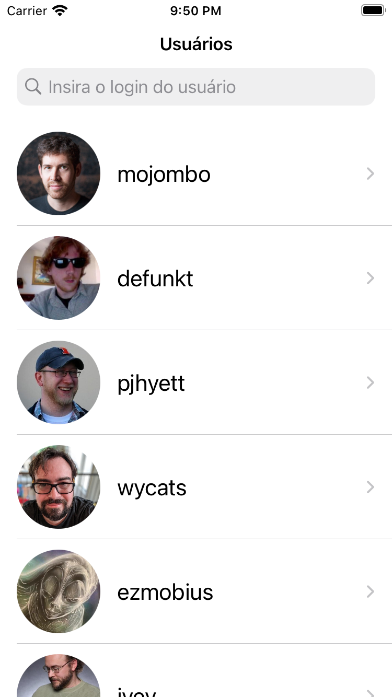
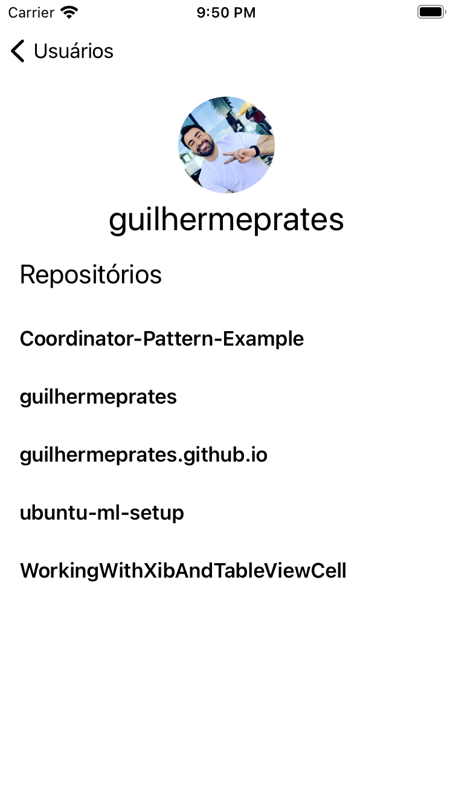

# GitClientApp

## Execução do Projeto

Siga os passos descritos abaixo para executar o projeto.

### 1 - Instale o [CocoaPods](https://cocoapods.org/)

Abra o terminar e digite o comando.

```
$ sudo gem install cocoapods
```

O [Homebrew](https://brew.sh/) também pode ser usado como uma alternativa para instalar o CocoaPods.

```
$ brew install cocoapods
```
 
### 2 - Instale as dependências do projeto

Ainda no terminal, execute o comando abaixo no diretório em que se encontra o projeto.

```
$ pod install
```

### 3 - Execute o projeto

Abra o projeto pelo arquivo com a extensão `.xcworkspace`.


## Bibliotecas Usadas

- [Alamofire](https://github.com/Alamofire/Alamofire) 
- [PromiseKit](https://github.com/mxcl/PromiseKit)
- [SnapKit](https://github.com/SVProgressHUD/SVProgressHUD)
- [Kingfisher](https://github.com/SnapKit/SnapKit)

## Imagens do Projeto

### Lista de usuários


### Busca por login do usuário


### Detalhes do usuário
